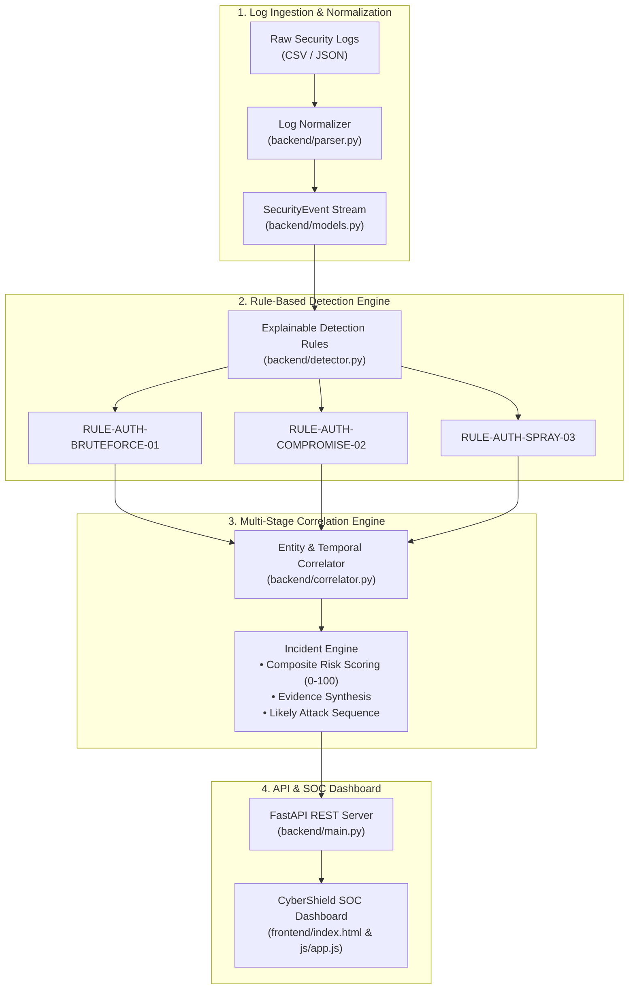

# CyberShield — Explainable Security Log Analysis & Intrusion Detection Platform

> **Hackathon Track:** Algothon’26  
> **Official Problem Statement:** `ALG-CYBER-01 — FIND THE INTRUDER`  
> **Team Project:** CyberShield  
> **Repository Location:** `D:\Algothon-CyberShield`

---

## 1. Problem Statement & Mission Overview

### One-Line Problem Statement
**ALG-CYBER-01**: Ingest security authentication logs, detect intrusion anomalies, correlate multi-step suspicious activities across entities, and synthesize an **explainable chronological attack sequence backed by concrete evidence**.

### Solution Overview
Modern SOC analysts face alert fatigue caused by thousands of disconnected alerts generated by opaque SIEM platforms. **CyberShield** is an explainable intrusion detection and incident correlation system that:
- Normalizes diverse CSV and JSON authentication logs into structured schemas.
- Applies deterministic, transparent behavioral rules with zero black-box AI dependencies.
- Correlates isolated alerts by origin IP, targeted account, and temporal proximity into unified **Incidents**.
- Reconstructs a human-readable **Likely Attack Sequence** with concrete evidence (breach timestamps, failure codes, and post-authentication activity).

---

## 2. Core Workflow & Architecture

### End-to-End Pipeline
```
Security Logs (CSV / JSON)
       ↓
Log Normalizer (Field extraction, timestamp parsing, schema typing)
       ↓
Detection Engine (Transparent, deterministic behavioral rules)
       ↓
Correlation Engine (Temporal clustering & entity grouping by IP/User)
       ↓
Incident & Risk Engine (Multi-stage scoring, evidence, attack sequencing)
       ↓
FastAPI Backend (REST API endpoints & caching)
       ↓
CyberShield SOC Dashboard (Real-time monitoring, metrics & forensic modal)
```

### Architecture Diagram



---

## 3. Core Features

- **P0 Requirements Fully Implemented:**
  - **Universal Log Ingestion**: Ingests custom CSV and JSON log files or pre-loaded hackathon demo datasets with one click.
  - **Explainable Anomaly Detection**: Transparent, deterministic rules with zero reliance on opaque third-party AI APIs.
  - **Suspicious Entity Identification**: Immediate ranking and attribution of malicious origin IPs and targeted user identities.
  - **Multi-Stage Event Correlation**: Clusters related activities by entity and time window instead of generating fragmented alerts.
  - **Chronological Incident Timeline**: Color-coded visualization tracing each event in the attack timeline.
  - **Verified Forensic Evidence**: Direct audit trace linking HTTP status codes, breach timestamps, and target resources.
- **P1 High-Value Features:**
  - **Likely Attack Sequence**: Synthesizes step-by-step attacker progression from initial access attempts to authenticated actions.
  - **Composite Risk Scoring**: Explainable weighted threat scoring (0–100) reflecting multi-stage confidence and severity.
  - **Forensic Investigation Drawer**: Deep drill-down view with interactive incident status lifecycle management (`New` → `Investigating` → `Resolved`).

---

## 4. Detection Approach & Explainability

CyberShield deliberately avoids opaque black-box machine learning models for core intrusion detection. Every detection produces an explainable reason, exact triggering parameters, and direct evidence:

| Rule ID | Rule Name | Category | Detection Logic & Triggers | Severity |
| :--- | :--- | :--- | :--- | :---: |
| `RULE-AUTH-BRUTEFORCE-01` | Repeated Failed Login Attempts | Credential Access | $\ge 3$ consecutive failed authentication attempts targeting an account or from an IP. | **HIGH** |
| `RULE-AUTH-COMPROMISE-02` | Failed Logins Followed by Successful Login | Credential Access | $\ge 2$ failed authentication attempts immediately followed by valid breakthrough login (Account Takeover). | **CRITICAL** |
| `RULE-AUTH-SPRAY-03` | Horizontal Password Spraying Pattern | Credential Access | Single origin IP attempting logins across $\ge 2$ distinct user accounts. | **CRITICAL** |

### Why This Is Explainable
1. **Deterministic Logic**: No probability thresholds or hallucinated triggers; every alert maps directly to a discrete log sequence.
2. **Auditable Evidence**: Each incident cites exact timestamps, originating IPs, affected accounts, and HTTP status codes.
3. **Attack Progression**: Shows the progression from enumeration and failed attempts to successful initial access.

---

## 5. Synthetic Dataset Overview

The dataset is tailored specifically for **ALG-CYBER-01 "Find the Intruder"**:

- **File Formats**: Available in both [`data/sample_security_logs.csv`](file:///D:/Algothon-CyberShield/data/sample_security_logs.csv) and [`data/sample_security_logs.json`](file:///D:/Algothon-CyberShield/data/sample_security_logs.json).
- **Ground Truth**: Ground-truth labels and scenario definitions are maintained in [`data/ground_truth.json`](file:///D:/Algothon-CyberShield/data/ground_truth.json).
- **Realistic Balancing**:
  - **Total Events**: `76`
  - **Normal Baseline Activity**: `60 events (78.9% - Clear Majority)` across legitimate enterprise users (`alice`, `bob`, `carol`, `david`, `emma`, `frank`, `grace`, `henry`) on internal subnet `192.168.1.0/24`.
  - **Suspicious Intruder Events**: `16 events (21.1%)` representing 3 distinct intrusion scenarios:
    1. **Scenario 2 (Brute Force)**: 5 failed logins targeting `admin_backup` from external IP `45.33.32.156`.
    2. **Scenario 3 (Credential Compromise)**: 4 failed attempts followed by breakthrough login and post-authentication activity by `sysadmin` from external IP `198.51.100.89`.
    3. **Scenario 4 (Password Spraying)**: Horizontal failed attempts cycling across `finance_lead`, `dev_ops`, `hr_manager`, and `qa_lead` from IP `203.0.113.42`.
  - **Scenario 5 (Edge Cases)**: Includes out-of-order timestamps, duplicate rows, and missing optional fields to verify parser robustness.

---

## 6. Technology Stack

- **Backend**: Python 3.11, [FastAPI](https://fastapi.tiangolo.com/), Uvicorn, Pydantic v2
- **Frontend**: Vanilla HTML5, CSS3, ES6+ JavaScript (Zero external build dependencies; runs anywhere)
- **Data Serialization**: Standard CSV and JSON
- **Styling**: CyberShield Dark SOC Theme with high legibility and responsive viewport design

---

## 7. REST API Endpoints

| Method | Endpoint | Description |
| :--- | :--- | :--- |
| `GET` | `/` | Serves CyberShield SOC Frontend Dashboard |
| `GET` | `/api/health` | Healthcheck endpoint (`HTTP 200 OK`) |
| `GET` | `/api/analyze/sample` | Ingests and analyzes pre-configured synthetic demo dataset |
| `POST` | `/api/analyze/upload` | Multipart file upload supporting custom CSV/JSON log ingestion |
| `GET` | `/api/incidents` | Lists all correlated incidents (supports `?risk_level=` filtering) |
| `GET` | `/api/incidents/{incident_id}` | Retrieves deep forensic details, evidence, and timeline for an incident |
| `PATCH` | `/api/incidents/{incident_id}/status` | Updates incident status (`New`, `Investigating`, `Resolved`) |

---

## 8. Quick Setup & Run Instructions

### Prerequisites
- Python 3.8+ installed and available on system PATH

### Step 1: Navigate to Project Directory
```powershell
cd D:\Algothon-CyberShield
```

### Step 2: Install Dependencies
```powershell
python -m pip install -r requirements.txt
```

### Step 3: Launch the Platform
In **PowerShell**, run:
```powershell
.\run.bat
```
*(or run `.\run.ps1`, or direct command: `python -m uvicorn backend.main:app --host 127.0.0.1 --port 8000 --reload`)*

In **Command Prompt (cmd.exe)** or by **double-clicking in File Explorer**:
```cmd
run.bat
```

### Step 4: Open in Web Browser
Open your browser to: **[http://127.0.0.1:8000](http://127.0.0.1:8000)**

---

## 9. 2-Minute Judge Demo Walkthrough

1. **Dashboard Overview**:
   - Open `http://127.0.0.1:8000`. The sample dataset loads automatically.
   - Point out the top 4 metric cards: **76 Total Logs Analyzed**, **16 Suspicious Events Flagged**, **3 Correlated Incidents**, **8 Monitored IPs / 11 Accounts**.
2. **Explainable Incident Correlation**:
   - Observe that the 16 suspicious log rows were correlated into **3 distinct incidents** rather than generating isolated alerts.
3. **Forensic Deep Dive (Incident INC-0002)**:
   - Click **"Forensics →"** on Incident `INC-0002` (`Intrusion Compromise Detected: sysadmin@198.51.100.89`).
   - Show the **Explainable Detection Rationale**: Transparent explanation of why it was flagged.
   - Show the **Likely Attack Sequence**:
     - *Step 1: Repeated Authentication Attempts -> 4 failed logins targeting 'sysadmin'*
     - *Step 2: Compromise / Successful Login -> valid breakthrough session*
     - *Step 3: Post-Authentication Activity -> navigation to administrative resources*
   - Show the **Verified Forensic Evidence**: Concrete failure status codes, breach timestamp, and origin IP.
   - Show the **Chronological Incident Timeline**: Step-by-step trace of every action.
4. **Custom Log Ingestion**:
   - Click **"Ingest Custom Logs"** to demonstrate parsing custom CSV/JSON log files on demand.

---

## 10. Automated Test Results

The platform includes 3 automated test suites covering all problem statement requirements:

```powershell
# 1. Base requirements test suite
python tests/test_detection.py

# 2. Ground-truth dataset & scenario validation test suite
python tests/test_dataset_scenarios.py

# 3. Multipart File Upload test suite
python tests/test_upload_endpoint.py
```

### Verification Results Summary:
- `TEST 1`: Normal login activity $\rightarrow$ 0 alerts / 0 false positives **(PASSED)**
- `TEST 2`: Repeated failed logins $\rightarrow$ Brute-force detected **(PASSED)**
- `TEST 3`: Failed logins followed by success $\rightarrow$ Compromise flagged as CRITICAL **(PASSED)**
- `TEST 4`: Related events $\rightarrow$ Correlated into 1 incident with attack sequence **(PASSED)**
- `TEST 5`: Forensic evidence & timeline $\rightarrow$ Displayed accurately **(PASSED)**
- `TEST 6`: Empty/malformed rows $\rightarrow$ Handled gracefully without crash **(PASSED)**
- `TEST 7`: Multiple users/IPs $\rightarrow$ Distinct entity attribution **(PASSED)**
- `TEST 8`: Format parity (CSV & JSON) $\rightarrow$ Exact match across formats **(PASSED)**
- `TEST 9`: Multipart CSV upload $\rightarrow$ HTTP 200 OK with accurate incident generation **(PASSED)**

---

## 11. Known Limitations & Future Improvements

### Known Limitations
- In-memory session cache: Ingested log analyses are stored in memory for rapid hackathon demonstration rather than persisted in an external database.
- Log formats: Native parser supports CSV and JSON formats; proprietary binary log formats (e.g., Windows EVTX binary) require conversion to JSON/CSV before ingestion.

### Future Improvements
- Automated containment hooks (e.g., automated firewall IP banning or user session revocation).
- Multi-source log ingestion (syslog over UDP/TLS, AWS CloudTrail, and GCP Cloud Audit logs).
- STIX/TAXII threat intelligence feed integration.

---

## 12. Project Disclosures

- **Synthetic Data**: All data in this repository is 100% synthetic and generated for demonstration purposes. No real credentials, private corporate records, or personal data are included.
- **AI-Assisted Development**: Developed with the assistance of Google Antigravity (Advanced Agentic AI) for algorithmic development, correlation engine implementation, automated testing, and UI styling in accordance with Algothon’26 regulations.
